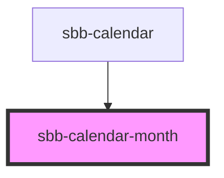

# sbb-calendar-month

<!-- Auto Generated Below -->

## Properties

| Property       | Attribute | Description                          | Type                      | Default     |
| -------------- | --------- | ------------------------------------ | ------------------------- | ----------- |
| `activeDate`   | --        | The currently active date.           | `Date`                    | `undefined` |
| `dateFilter`   | --        | A function used to filter out dates. | `(date: Date) => boolean` | `undefined` |
| `maxDate`      | --        | The maximum valid date.              | `Date`                    | `undefined` |
| `minDate`      | --        | The minimum valid date.              | `Date`                    | `undefined` |
| `selectedDate` | --        | The selected date.                   | `Date`                    | `undefined` |

## Events

| Event           | Description                      | Type                |
| --------------- | -------------------------------- | ------------------- |
| `date-selected` | Event emitted on date selection. | `CustomEvent<Date>` |

## Slots

| Slot        | Description                  |
| ----------- | ---------------------------- |
| `"unnamed"` | Use this to document a slot. |

## Dependencies

### Used by

 - [sbb-calendar](../sbb-calendar)

### Graph

----------------------------------------------

